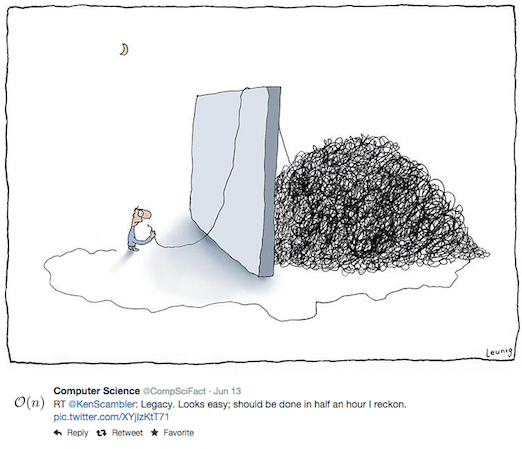
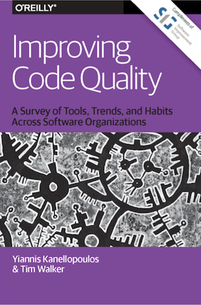
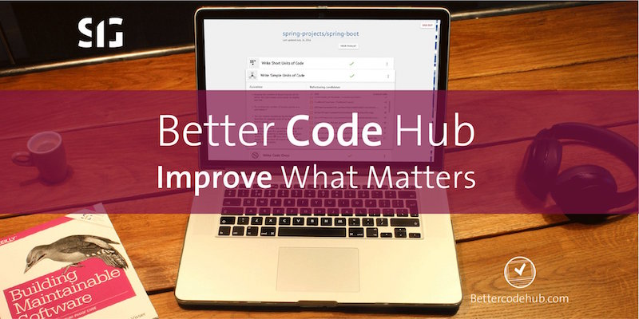
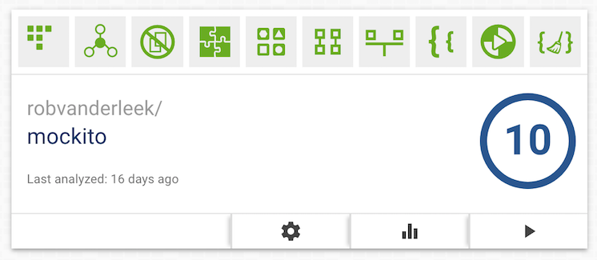
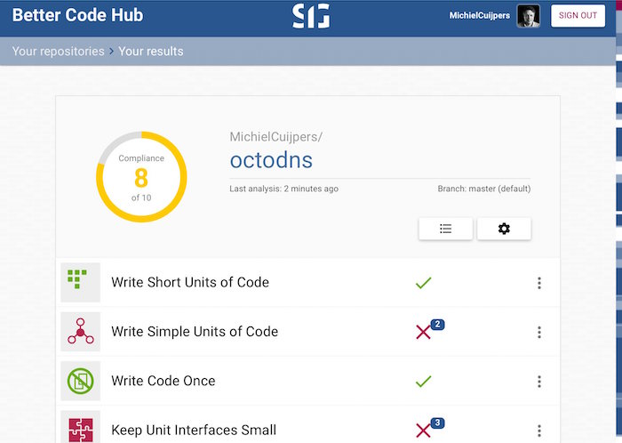
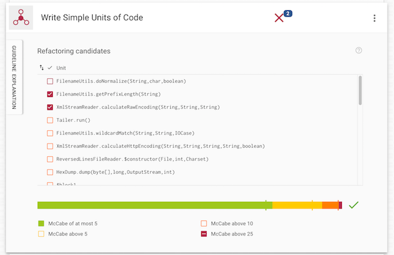
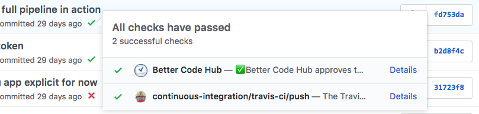
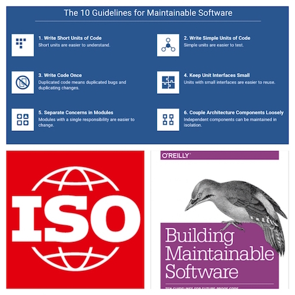

---?image=assets/bch-bg.png

### Introducing
## Better Code Hub
#### Your Definition of Done for Code Quality

---

## The Challenge of InnerSourcing

To enable *code reuse*, *cross-team collaboration* and *faster development*,
code must be maintainable.

+++

Nobody wants to adopt legacy code

+++

#### Code Quality tools prevent legacy code, but...

<canvas class="stretch" data-chart="horizontalBar">
dataset, 46, 36, 35, 28, 27, 14
<!-- 
{ 
 "data" : {
  "labels" : ["Too many false positives", "Too many warnings", "High price", 
    "Difficult to configure", "No actionable recommendations", 
    "Lack a broadly accepted quality standard"], 
  "datasets" : [{ 
    "data": [46, 36, 35, 28, 27, 14],
    "backgroundColor": "springgreen",
    "borderColor": "springgreen" 
  }]
  },
  "options": {
    "title": {
      "display": true,
      "text": "What are the biggest pitfalls of code quality tools?",
      "fontColor": "springgreen",
      "fontSize": 20
    },
    "legend": {
      "display": false
    },
    "scales": {
      "xAxes": [{
        "ticks": {
            "beginAtZero": true,
            "max": 80,
            "stepSize": 10,
            "fontColor": "springgreen"
        },
        "scaleLabel": {
          "display": true,
          "labelString": "Percentage of respondents (T=899)",
          "fontColor": "springgreen"
        }
      }],
      "yAxes": [{
        "ticks": {
            "fontColor": "springgreen"
        }
      }]
    }
  }
}
-->
<ccanvas>

+++ 

Read more: [Improving Code
Quality](https://www.sig.eu/insight/improving-code-quality/)

---
<!-- 
.reveal section img {
  border: 0;
  box-shadow: none;
} 
-->  

## Our Solution

A *different* Code Quality tool

+++

Provides teams a Definition of Done for Code Quality 

+++

Does not flood you with violations

+++

Actionable refactoring recommendations with impact analysis

+++

Zero set-up time and immediate developer feedback

+++

[Based on ISO 25010 standard for Software Quality](https://shop.oreilly.com/product/0636920049159.do)

+++

### Why Better Code Hub

- Provides a Definition of Done for Code Quality 
- Zero-setup time; first results within a couple of minutes
- Feedback on every Push and every Pull Request
- Supports 16 modern programming languages
- Prioritized list of refactoring candidates
- Real-time impact estimates
- Metric thresholds derived from industry benchmark data

---

## Our Offerings

#### Better Code Hub for GitHub.com

For individual developers & small development teams as well as large
enterprises that use the GitHub.com platform

#### Better Code Hub for GitHub Enterprise

For organizations that use an on-premise GitHub Enterprise server

+++

### Better Code Hub for GitHub.com

- [Available on GitHub Marketplace](https://github.com/marketplace/better-code-hub)

- Pricing
  - Free plan: free for open source, limit 100,000 lines of code per repository
  - Pro plan: $20 per user/month, limit 200,000 lines of code per repository
- Perfect fit for a [modern CI/CD pipeline](https://medium.com/bettercode/how-to-build-a-modern-ci-cd-pipeline-5faa01891a5b)

+++

### Better Code Hub for GitHub Enterprise

- SaaS solution that connects to on-premise GitHub Enterprise server ([client case](https://www.exact.com/global/newsroom/inside-exact/573-code-quality-is-key-to-a-successful-company)) 
- SIG is ISO 27001 certified
- No permanent storage of source code on Better Code Hub infrastructure
- Pricing per user/month + yearly service fee
- Option to bundle with other SIG services

---

## Our Community Offerings

- [EduPack: Code Clinics](https://education.github.community/t/a-proposed-add-on-for-code-quality-in-software-engineering-courses-using-github/9067) 
- [Open Source Spring Cleaning](https://opensourcespringcleaning.github.io/)
- [Support for Hackathons](https://dev.to/jstvssr/how-a-hackathon-appreciates-quality-code)

---

## How to Stay in Touch

- <bettercodehub@sig.eu>
- Twitter: [@bettercodehub](https://twitter.com/bettercodehub)
- Medium: [medium.com/bettercode](https://medium.com/bettercode)
- Newsletter: [Better Code Update](http://us14.campaign-archive1.com/home/?u=104bf91e618a0b2a854bdea20&id=97fcbfb998)

This presentation: <https://gitpitch.com/bettercodehub/pitch>  
✨ Thanks for your time! ✨
